# Cloudflare Stats Worker

[](https://github.com/Zakkaus/cloudflare-stats-worker/releases)
[](https://deploy.workers.cloudflare.com/?url=https://github.com/Zakkaus/cloudflare-stats-worker)

🚀 **輕量級觸發式統計系統** — 基於 Cloudflare Workers + KV + D1，兼顧隱私、成本與部署速度。本文提供完整安裝指南、儀表板亮點與 Blowfish 整合做法。

---

## 目錄

- [為什麼選擇 Cloudflare Stats Worker](#為什麼選擇-cloudflare-stats-worker)
- [免費額度與升級選項](#免費額度與升級選項)
- [架構與資料流](#架構與資料流)
- [儀表板亮點](#儀表板亮點)
- [部署前準備](#部署前準備)
- [步驟 1：取得專案原始碼](#步驟-1取得專案原始碼)
- [步驟 2：執行安裝腳本](#步驟-2執行安裝腳本)
- [步驟 3：驗證-api](#步驟-3驗證-api)
- [步驟 4：匯入-hugo-前端腳本](#步驟-4匯入-hugo-前端腳本)
- [步驟 5：覆寫-blowfish-模板](#步驟-5覆寫-blowfish-模板)
- [步驟 6：本地測試](#步驟-6本地測試)
- [步驟 7：建立統計儀表板頁面](#步驟-7建立統計儀表板頁面)
- [API 端點快速索引](#api-端點快速索引)
- [維運筆記](#維運筆記)
- [常見問題](#常見問題)

---

## 為什麼選擇 Cloudflare Stats Worker

- **單一 Worker 全部搞定**：API、儀表板、快取失效與 D1 同步打包在一起。
- **隱私友善**：無 Cookie，IP 以 SHA-256 雜湊截斷，資料完全掌握在自己手中。
- **多語言友善**：`normalizePath()` 自動把 `/zh-tw/posts/foo/`、`/posts/foo/` 視為同一頁。
- **部署秒上線**：`wrangler deploy` 一鍵推送，支援自訂網域。
- **Hugo Blowfish 專用腳本**：官方 partial 範例確保 slug 一致，無需額外 CSS。

## 免費額度與升級選項

| 服務 | 免費方案 | 付費方案重點 |
|------|----------|---------------|
| **Cloudflare Workers** | 每日 100k 請求、10ms CPU | Workers Paid $5/月：10M 請求、額外 CPU 配額、優先排程 |
| **Cloudflare KV** | 1GB 儲存、每日 100k 讀取 / 1k 寫入 | Workers Paid 內含 10M 讀取/1M 寫入，上限外依次數計費 |
| **Cloudflare D1** | 每月 5M 查詢、1GB 儲存 | D1 Paid 依查詢量計價，適合大流量排行或長期報表 |

> 小提醒：若只需要即時 PV/UV 計數，可僅使用 KV，D1 功能為選配。

## 架構與資料流

```mermaid
graph LR
  User[訪客] -->|/api/count| Worker
  User -->|/api/batch| Worker
  Dashboard[stats 子網域儀表板] -->|/api/stats /api/daily /api/top| Worker
  Worker -->|寫入/讀取| KV[(Cloudflare KV)]
  Worker -->|可選| D1[(Cloudflare D1)]
```



- 每個 API 回傳 JSON 並攜帶寬鬆 CORS (`Access-Control-Allow-Origin: *`)。
- 當 `/api/top` 偵測到 D1 為空，會自動從 KV 回填熱門排行，確保儀表板不中斷。
- 所有統計皆以 `page:/posts/foo/:pv`、`:uv` 命名，避免語系差異造成分裂。

## 儀表板亮點

實際運作範例：**[stats.zakk.au](https://stats.zakk.au/)**

- 深 / 淺色主題切換、繁中 / 英文介面、一鍵跳轉文章。
- 今日 / 全站 PV・UV 卡片 + API 健康狀態。
- 7、14、30 日 Chart.js 趨勢圖，零資料時自動顯示空狀態。
- 熱門頁面 Top 10、快速搜尋任意 path、顯示 UTC 更新時間。
- 部署後即為獨立網站—選配可透過 iframe / 短碼嵌入博客。

## 部署前準備

- Cloudflare 帳號 + Wrangler CLI（`npm install -g wrangler`）。
- Node.js 18 以上版本。
- Git 與 shell 環境（macOS、Linux、WSL 皆可）。
- 若要綁定 `stats.example.com`，請先在 Cloudflare 設定該網域代理。

---

## 步驟 1：取得專案原始碼

```bash
git clone https://github.com/Zakkaus/cloudflare-stats-worker.git
cd cloudflare-stats-worker
```

專案重點：

- `src/index.js`：Worker 路由、快取失效、D1 同步等核心邏輯。
- `dashboard/`：儀表板靜態資源，部署時自動隨 Worker 一起推送。
- `scripts/`：一鍵部署與驗證腳本。
- `schema.sql`：D1 所需資料表定義。

## 步驟 2：執行安裝腳本

```bash
chmod +x scripts/deploy.sh
./scripts/deploy.sh --domain stats.example.com
```

腳本流程：

1. 檢查 Wrangler 是否登入（必要時跳出提示）。
2. 建立 KV 命名空間並寫回 `wrangler.toml`。
3. 若偵測到 D1 ID，會自動套用 `schema.sql`。
4. 部署 Worker 並輸出 dashboard / API URL。

想手動部署可依序執行：

```bash
wrangler kv namespace create PAGE_STATS
wrangler kv namespace create PAGE_STATS --preview
wrangler d1 create cloudflare-stats-top             # 選配
wrangler d1 execute cloudflare-stats-top --file=schema.sql --remote
wrangler deploy
```

## 步驟 3：驗證 API

```bash
curl https://stats.example.com/health
curl "https://stats.example.com/api/count?url=/" | jq
curl "https://stats.example.com/api/stats" | jq
curl "https://stats.example.com/api/top?limit=5" | jq
```

或使用專案提供的驗證腳本一次檢查所有端點：

```bash
./scripts/verify.sh https://stats.example.com
```

## 步驟 4：匯入 Hugo 前端腳本

1. 將 `client/cloudflare-stats.js` 複製到你的 Hugo 專案，例如 `assets/js/cloudflare-stats.js`。
2. 在 `layouts/partials/extend-head.html` 新增：
   ```go-html-template
   {{ $stats := resources.Get "js/cloudflare-stats.js" | resources.Minify | resources.Fingerprint }}
   <script defer src="{{ $stats.RelPermalink }}"
           data-api="https://stats.example.com"
           data-site="https://zakk.au"></script>
   ```
3. 重新編譯 Hugo，確認文章頁腳的 PV 佔位符有載入動畫。

## 步驟 5：覆寫 Blowfish 模板

為確保多語言路徑共用同一鍵值，建議覆寫：

- `layouts/_default/list.html`
- `layouts/_default/single.html`
- `layouts/partials/meta/views.html`
- `layouts/partials/meta/likes.html`

核心邏輯為建立統一的 slug：

```go-html-template
{{- $path := partial "stats/normalize-path" . -}}
<span id="views_{{ $path }}" class="stats-views animate-pulse">—</span>
```

`partial "stats/normalize-path"` 可去除 `/index`、語系前綴，確保計數集中。

## 步驟 6：本地測試

```bash
wrangler dev
# 另開終端
hugo server -D
```

- 透過 `http://127.0.0.1:8787/api/count?url=/` 測試計數。
- 在文章頁的網路面板確認 `/api/batch`、`/api/count` 正常回應。
- 想壓測可用 `npx autocannon` 或 `hey` 打 `/api/count`，觀察速率限制行為。

## 步驟 7：訪問儀表板

部署完成後，直接訪問你的儀表板網域：

```
https://stats.example.com/
```

你會看到與 [stats.zakk.au](https://stats.zakk.au/) 相同的介面：

- 即時今日/全站 PV・UV 卡片
- API 健康狀態指示燈
- 7/14/30 日趨勢圖表
- 熱門頁面 Top 10 排行
- 深淺色主題與繁中/英文切換

**選配：嵌入 Hugo 頁面**

想在博客頁面嵌入儀表板？使用提供的短碼：

```markdown

```

- 短碼來源：`layouts/shortcodes/statsDashboard.html`。
- 支援自訂高度、深色模式樣式，並可在 `content/stats/index.*.md` 中使用。
- 若想完全客製，可直接將 `dashboard/` 內容搬到 Hugo partial。

---

## API 端點快速索引

| 方法 | 路徑 | 說明 | 寫入 | 預設快取 |
|------|------|------|------|----------|
| `GET` | `/api/count?url=/path/` | 遞增 PV/UV 並回傳頁面與站台數據 | ✅ | ❌ |
| `GET` | `/api/stats?url=/path/` | 單頁統計查詢 | ❌ | ✅ (30s) |
| `GET` | `/api/stats` | 全站統計查詢 | ❌ | ✅ (30s) |
| `GET` | `/api/batch?urls=/,/about/` | 批量查詢（最多 50 個路徑） | ❌ | ✅ (30s) |
| `GET` | `/api/top?limit=10` | 熱門頁面排行（需 D1） | ❌ | ✅ (60s) |
| `GET` | `/api/daily?days=7` | 每日 PV/UV 時序（需 D1） | ❌ | ✅ (30s) |
| `GET` | `/health` | Worker 狀態、版本號 | ❌ | ❌ |

所有回應皆包含 UTC `timestamp`，方便前端顯示「最後更新於」資訊。

## 維運筆記

### 全站清除統計（KV + D1)

> 由於 `/api/top` 會在 D1 為空時自動從 KV 回填，**務必先清空 KV，再刪除 D1**。

```bash
# 1. 刪除 KV 正式環境全部鍵
wrangler kv key list --binding=PAGE_STATS --preview false --remote \
  | jq -r '.[].name' \
  | xargs -I{} wrangler kv key delete "{}" --binding=PAGE_STATS --preview false --remote

# 2. 清除 D1 資料
wrangler d1 execute cloudflare-stats-top --command "DELETE FROM page_stats;" --remote
wrangler d1 execute cloudflare-stats-top --command "DELETE FROM site_daily_stats;" --remote

# 3. 驗證是否為空
wrangler kv key list --binding=PAGE_STATS --preview false --remote
wrangler d1 execute cloudflare-stats-top --command "SELECT COUNT(*) AS count FROM page_stats;" --remote
curl -s https://stats.example.com/api/top?limit=5
```

### `/api/top` 仍顯示舊資料怎麼辦？

- 確認 KV 是否還有 `page:*` 鍵存在。
- Cloudflare Cache 預設 60 秒，可稍候或造訪 `/health` 觸發快取失效。
- 檢查是否有其他節點（例如 `wrangler dev`）仍在寫入。

## 常見問題

**Q：為什麼不用 Google Analytics？**  
A：自架方案隱私透明、可在中國直接使用，且對靜態站性能影響低。

**Q：前端腳本會拖慢載入嗎？**  
A：腳本以 `defer` 載入，並使用 `/api/batch` 批次請求，對首屏影響極小。

**Q：可以自訂資料模型嗎？**  
A：可以。你可在 Worker 中改寫 KV 結構、加入 D1 表格或接入 Cloudflare Queues 做離線分析。

**Q：如何排除內部流量？**  
A：在 `src/index.js` 的 `enforceRateLimit` 或 `handleCount` 中加入 IP / User-Agent 白名單判斷即可。

---

- 線上示例：https://stats.zakk.au  
- 版本資訊：[`CHANGELOG.md`](CHANGELOG.md)  
- 授權：MIT License（詳見 [`LICENSE`](LICENSE)）

